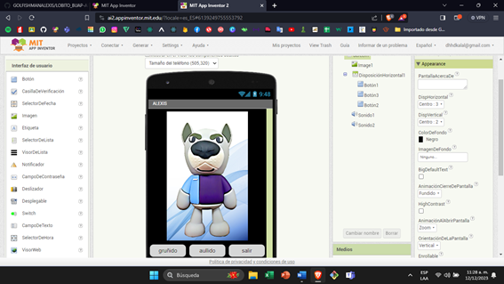
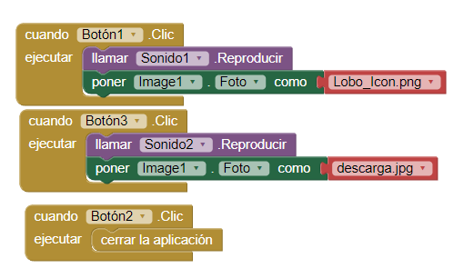

# LOBITO BUAP APP INVENTOR PROYECTO 1

Esta es la vista previa en app inventor consta de los siguientes elementos:  
\-Imagen

\-disposición horizontal:

\-Boton 1 : gruñido

\-Boton2: Salir

\-Boton3: aullido

\-Dos componentes de sonido

## BLOQUES DE APP INVENTOR

## 

## BLOQUES FUNCIONAMIENTO

La aplicación con cuatro archivos dos de sonido y dos descargas al presionar el botón 1 re llama al sonido 1 y lo reproduce a su misma vez llama la imagen para cambiarla cuando se presiona el botón 3 llama al sonido dos y se cambia a la imagen dos al botón dos al presionar los cierra la aplicación

## LINK DE GALERIA

  <a href="https://gallery.appinventor.mit.edu/?galleryid=ca03cd63-20db-42e5-97c7-ef6aa75a82b0" style="text-decoration: none; display: inline-block; padding: 10px 20px; border: 2px solid #555; border-radius: 5px; background-color: #007bff; color: #fff; font-size: 16px;" rel="noopener">
    GALERÍA
  </a>

## link de APK

  <a href="https://drive.google.com/file/d/1f1k1qEGlmlN-eJc76iYrfnChc8TkL4zd/view?usp=sharing" style="text-decoration: none; display: inline-block; padding: 10px 20px; border: 2px solid #555; border-radius: 5px; background-color: #007bff; color: #fff; font-size: 16px;" rel="noopener">
    APK
  </a>

